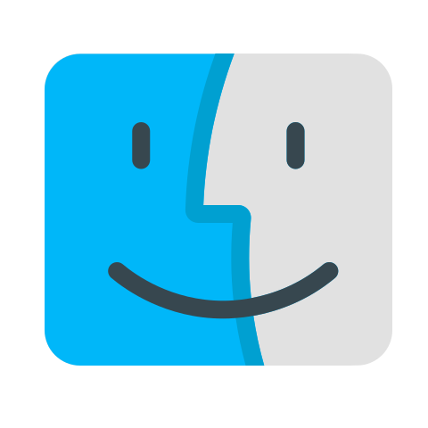

  
  

\

---

Indie game developed by only one person in the genre: `Casual`, `Endless Runner`.\
You play as a dog, endlessly chasing a ginger cat, hoping to finally catch him, but every time he manages to run faster, catch that cat already!

## Platforms
<table>
  <tr>
    <td align="center">Android <code><b>✔️AVAILABLE</b></code></td>
    <td align="center">Windows <code><b>✔️AVAILABLE</b></code></td>
    <td align="center">Linux <code><b>✔️AVAILABLE</b></code></td>
    <td align="center">MacOS <code><b>❌NOT SUPPORTED</b></code></td>
    <td align="center">IOS <code><b>❌NOT SUPPORTED</b></code></td>
  </tr>
  <tr>
    <td align="center"></td>
    <td align="center"></td>
    <td align="center"></td>
    <td align="center"></td>
    <td align="center"></td>
  </tr>
</table>

---

